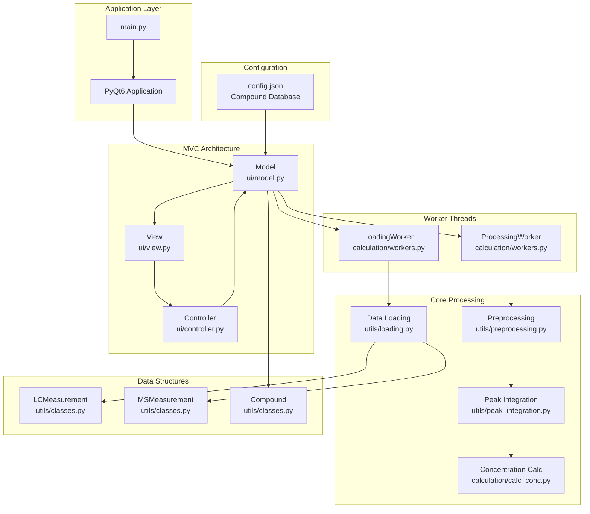
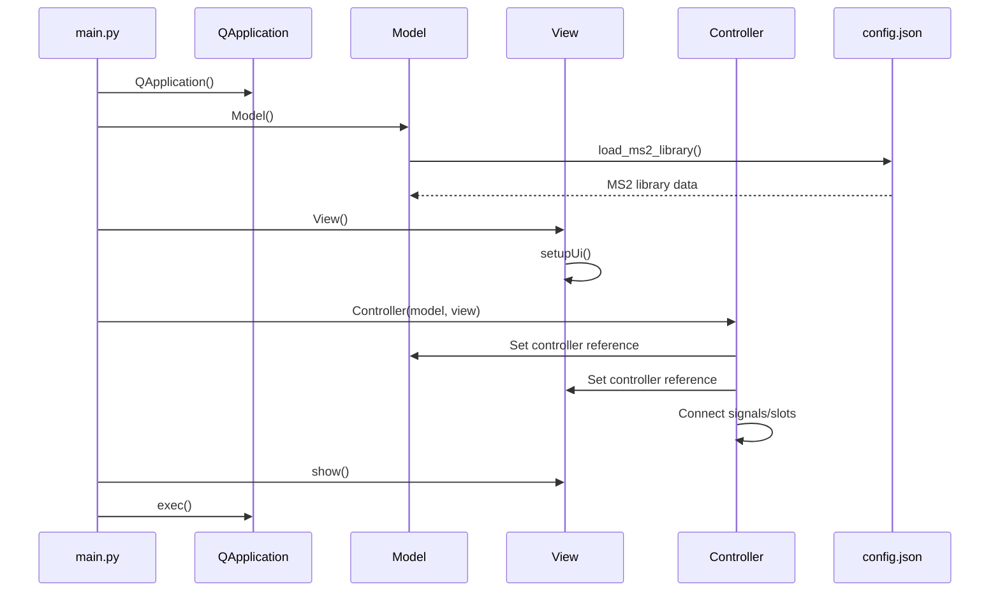
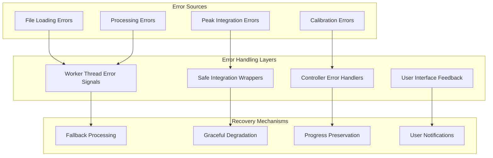
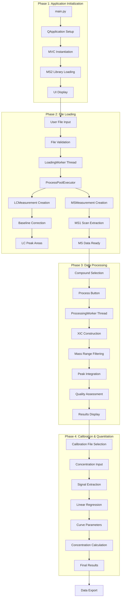
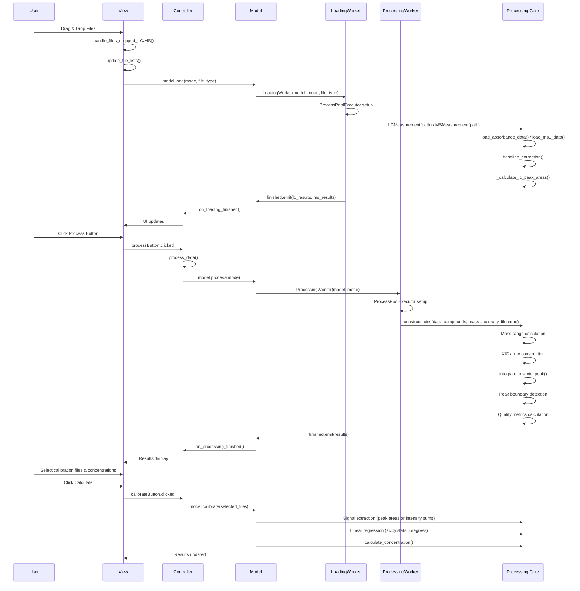

# LC-Inspector Processing Pipeline: Comprehensive Flow Diagram

**Technical Documentation for LC-Inspector LC/GC-MS Data Processing System**

---

## Table of Contents

1. [System Architecture Overview](#system-architecture-overview)
2. [MVC Component Interactions](#mvc-component-interactions)
3. [Application Initialization](#application-initialization)
4. [File Loading Pipeline](#file-loading-pipeline)
5. [Data Processing Pipeline](#data-processing-pipeline)
6. [Calibration and Quantitation Workflow](#calibration-and-quantitation-workflow)
7. [Peak Integration System](#peak-integration-system)
8. [Configuration and Compound Database](#configuration-and-compound-database)
9. [Error Handling and Thread Management](#error-handling-and-thread-management)
10. [Complete Processing Flow Diagrams](#complete-processing-flow-diagrams)

---

## System Architecture Overview

LC-Inspector implements a sophisticated MVC (Model-View-Controller) architecture with parallel processing capabilities for handling large-scale LC/GC-MS data analysis.

### Core Components



---

## MVC Component Interactions

### Detailed Component Responsibilities

#### Model ([`ui/model.py`](lc-inspector/ui/model.py))
- **Data Management**: Stores `ms_measurements`, `lc_measurements`, `annotations`, `compounds`
- **Worker Coordination**: Manages [`LoadingWorker`](lc-inspector/calculation/workers.py:48) and [`ProcessingWorker`](lc-inspector/calculation/workers.py:120)
- **Calibration Logic**: Implements [`calibrate()`](lc-inspector/ui/model.py:82) with linear regression
- **MS2 Library Management**: Loads and searches MS2 spectral library
- **Data Export**: Generates comprehensive results with peak area information

#### View ([`ui/view.py`](lc-inspector/ui/view.py))
- **GUI Components**: Tabbed interface with Upload, Results, and Quantitation tabs
- **Drag-Drop Interface**: Handles file input via [`DragDropListWidget`](lc-inspector/ui/widgets.py)
- **Real-time Plotting**: PyQtGraph-based visualization with crosshairs and interaction
- **Progress Feedback**: Progress bars and status updates during processing
- **Configuration Interface**: Ion table management and compound selection

#### Controller ([`ui/controller.py`](lc-inspector/ui/controller.py))
- **Event Handling**: Connects GUI signals to model methods
- **Workflow Orchestration**: Manages processing sequence and state transitions
- **Error Management**: Handles worker errors and user feedback
- **Data Validation**: Ensures data integrity before processing

---

## Application Initialization

### Startup Sequence



### Key Initialization Steps

1. **Logging Configuration**: [`configure_logging()`](lc-inspector/main.py:28) sets up file and console logging
2. **Application Creation**: PyQt6 QApplication with "Fusion" style
3. **MVC Setup**: Model, View, Controller instantiation and cross-referencing
4. **MS2 Library Loading**: [`load_ms2_library()`](lc-inspector/utils/loading.py:160) from resources
5. **Signal Connection**: Event handlers for user interactions

---

## File Loading Pipeline

### Multi-threaded File Loading Architecture

```mermaid
graph TB
    subgraph "User Interface"
        A[Drag & Drop Files] --> B[File Validation]
        C[Browse Button] --> B
    end
    
    subgraph "Controller Layer"
        B --> D[update_file_lists()]
        D --> E[model.load()]
    end
    
    subgraph "Model Layer"
        E --> F[LoadingWorker Creation]
        F --> G[Worker Thread Start]
    end
    
    subgraph "LoadingWorker Thread"
        G --> H[ProcessPoolExecutor]
        H --> I[Parallel File Loading]
        I --> J[LCMeasurement Creation]
        I --> K[MSMeasurement Creation]
    end
    
    subgraph "Data Processing"
        J --> L[load_absorbance_data()]
        L --> M[baseline_correction()]
        M --> N[_calculate_lc_peak_areas()]
        
        K --> O[load_ms1_data()]
        O --> P[Scan Object Creation]
    end
    
    subgraph "Results"
        N --> Q[LC Peak Areas]
        P --> R[MS Scan Data]
        Q --> S[Progress Updates]
        R --> S
        S --> T[UI Updates]
    end
```

### File Loading Workflow Details

#### Phase 1: File Input and Validation
- **Supported Formats**: 
  - LC data: `.txt`, `.csv` files
  - MS data: `.mzML` files
- **Validation Logic**: [`handle_files_dropped_LC()`](lc-inspector/ui/view.py:28), [`handle_files_dropped_MS()`](lc-inspector/ui/view.py:64)
- **Error Handling**: Type validation with user feedback

#### Phase 2: Worker Thread Initialization
- **Worker Creation**: [`LoadingWorker(model, mode, file_type)`](lc-inspector/calculation/workers.py:53)
- **Progress Signals**: `progressUpdated`, `finished`, `error`
- **Thread Safety**: PyQt6 signal-slot mechanism for UI updates

#### Phase 3: Parallel Processing
- **ProcessPoolExecutor**: CPU count optimization (`max_workers=max(1, cpu_count-3)`)
- **LC Processing**: [`LCMeasurement(path)`](lc-inspector/utils/classes.py:61) with baseline correction
- **MS Processing**: [`MSMeasurement(path)`](lc-inspector/utils/classes.py:173) with MS1 scan extraction

#### Phase 4: Data Structure Creation
- **LC Measurements**: 
  - [`load_absorbance_data()`](lc-inspector/utils/loading.py:27) for chromatogram parsing
  - [`baseline_correction()`](lc-inspector/utils/preprocessing.py:10) using LLS algorithm
  - [`_calculate_lc_peak_areas()`](lc-inspector/utils/classes.py:75) for peak detection
- **MS Measurements**:
  - [`load_ms1_data()`](lc-inspector/utils/loading.py:105) using pyteomics.mzml
  - Scan object creation with retention time indexing

---

## Data Processing Pipeline

### XIC Construction and Peak Integration

```mermaid
graph TB
    subgraph "Processing Trigger"
        A[User Clicks Process] --> B[Validate Input Data]
        B --> C[Extract Compounds from Ion Table]
    end
    
    subgraph "ProcessingWorker Thread"
        C --> D[ProcessingWorker Creation]
        D --> E[ProcessPoolExecutor Setup]
        E --> F[Parallel XIC Construction]
    end
    
    subgraph "Core Processing"
        F --> G[construct_xics()]
        G --> H[Mass Range Calculation]
        H --> I[Scan Intensity Extraction]
        I --> J[XIC Array Construction]
        J --> K[Peak Integration]
    end
    
    subgraph "Peak Integration System"
        K --> L[integrate_ms_xic_peak()]
        L --> M[Peak Boundary Detection]
        M --> N[Baseline Calculation]
        N --> O[Trapezoidal Integration]
        O --> P[Quality Metrics]
    end
    
    subgraph "Result Processing"
        P --> Q[Peak Area Data]
        Q --> R[Retention Time Assignment]
        R --> S[Compound Object Update]
        S --> T[Progress Updates]
        T --> U[UI Result Display]
    end
```

### Detailed Processing Steps

#### Step 1: User Input Validation
```python
# From controller.py:process_data()
def process_data(self):
    self.model.compounds = self.view.ionTable.get_items()
    if not self.model.compounds:
        self.view.show_critical_error("No compounds found!")
        return
```

#### Step 2: XIC Construction ([`construct_xics()`](lc-inspector/utils/preprocessing.py:89))
```python
def construct_xics(data, ion_list, mass_accuracy, file_name):
    compounds = copy.deepcopy(ion_list)
    for compound in compounds:
        for ion in compound.ions.keys():
            # Mass range calculation
            mass_range = (ion-3*mass_accuracy, ion+3*mass_accuracy)
            
            # Intensity extraction per scan
            for scan in data:
                indices = np.where(np.logical_and(
                    scan['m/z array'] >= mass_range[0], 
                    scan['m/z array'] <= mass_range[1]
                ))
                intensities = scan['intensity array'][indices]
                xic.append(np.sum(intensities))
```

#### Step 3: Peak Integration Enhancement
- **Enhanced Algorithm**: [`integrate_ms_xic_peak()`](lc-inspector/utils/peak_integration.py:39)
- **Boundary Detection**: Adaptive thresholds based on signal statistics
- **Quality Metrics**: SNR calculation, peak symmetry, baseline stability
- **Error Handling**: [`safe_peak_integration()`](lc-inspector/utils/peak_integration.py:630) with fallback options

---

## Calibration and Quantitation Workflow

### Calibration Process Flow

```mermaid
graph TB
    subgraph "Calibration Setup"
        A[User Selects Calibration Files] --> B[Enter Concentrations]
        B --> C[Click Calculate Button]
    end
    
    subgraph "Calibration Processing"
        C --> D[model.calibrate()]
        D --> E[Parse Concentration Values]
        E --> F[Unit Conversion]
        F --> G[Extract Peak Areas/Intensities]
    end
    
    subgraph "Signal Extraction Strategy"
        G --> H{Peak Area Available?}
        H -->|Yes| I[Use baseline_corrected_area]
        H -->|No| J[Fallback to Intensity Sum]
        I --> K[Sum Ion Peak Areas]
        J --> K
    end
    
    subgraph "Curve Fitting"
        K --> L[Build Calibration Points]
        L --> M[Linear Regression]
        M --> N[Store Curve Parameters]
    end
    
    subgraph "Concentration Calculation"
        N --> O[Apply to All Files]
        O --> P[calculate_concentration()]
        P --> Q[Signal Extraction]
        Q --> R[Apply Calibration Formula]
        R --> S[Store Results]
    end
```

### Calibration Implementation Details

#### Enhanced Signal Extraction ([`model.calibrate()`](lc-inspector/ui/model.py:82))
```python
# Priority: Peak areas over intensity sums
for ion in compound.ions.keys():
    ion_data = ms_file.xics[i].ions[ion]
    
    # Enhanced: Use peak area if available
    if 'MS Peak Area' in ion_data and ion_data['MS Peak Area'].get('baseline_corrected_area', 0) > 0:
        compound_signal += ion_data['MS Peak Area']['baseline_corrected_area']
        use_peak_areas = True
    else:
        # Fallback to original intensity sum
        if ion_data['MS Intensity'] is not None:
            compound_signal += np.round(np.sum(ion_data['MS Intensity'][1]), 0)
```

#### Concentration Calculation ([`calculate_concentration()`](lc-inspector/calculation/calc_conc.py:4))
```python
def calculate_concentration(area, curve_params):
    slope = curve_params['slope']
    intercept = curve_params['intercept']
    
    if slope == 0:
        return 0
    
    concentration = (area - intercept) / slope
    
    if np.isnan(concentration) or not np.isfinite(concentration):
        return 0
    
    return round(concentration, 6)
```

---

## Peak Integration System

### Enhanced Peak Integration Algorithm

```mermaid
graph TB
    subgraph "Peak Detection"
        A[Input: RT/Intensity Arrays] --> B[Signal Statistics]
        B --> C[Adaptive Prominence Calculation]
        C --> D[find_peaks()]
        D --> E[Peak Maximum Selection]
    end
    
    subgraph "Boundary Detection"
        E --> F[detect_peak_boundaries()]
        F --> G[Adaptive Thresholds]
        G --> H[Valley Detection]
        H --> I[Time Constraints Check]
        I --> J[Minimum Width Validation]
    end
    
    subgraph "Baseline Calculation"
        J --> K[calculate_baseline_linear()]
        K --> L[Linear Interpolation]
        L --> M[Baseline Correction]
    end
    
    subgraph "Integration"
        M --> N[integrate_peak_area_trapezoidal()]
        N --> O[Total Area Calculation]
        O --> P[Baseline-Corrected Area]
    end
    
    subgraph "Quality Assessment"
        P --> Q[calculate_peak_quality_metrics()]
        Q --> R[SNR Calculation]
        R --> S[Peak Symmetry Analysis]
        S --> T[Baseline Stability]
        T --> U[Combined Quality Score]
    end
```

### Peak Integration Features

#### Adaptive Parameter Calculation
```python
# Enhanced adaptive prominence for STMIX validation
signal_max = np.max(corrected_values)
signal_std = np.std(corrected_values)
noise_level = np.std(corrected_values[corrected_values <= np.percentile(corrected_values, 25)])
baseline_level = np.percentile(corrected_values, 10)

prominence_threshold = max(
    5.0,  # Absolute minimum
    noise_level * 4,  # 4x noise level
    signal_std * 2,   # 2x standard deviation
    (signal_max - baseline_level) * 0.005  # 0.5% of signal range
)
```

#### Quality Metrics System
- **SNR Calculation**: Signal-to-noise ratio with sophisticated noise estimation
- **Peak Symmetry**: Tailing factor assessment using USP method
- **Baseline Stability**: Flatness assessment of surrounding regions
- **Combined Quality Score**: Weighted combination (SNR: 40%, Symmetry: 35%, Baseline: 25%)

---

## Configuration and Compound Database

### Compound Database Structure

The [`config.json`](lc-inspector/config.json) file contains comprehensive compound databases organized by categories:

```json
{
    "Amino acids and polyamines (DEEMM)": {
        "Adenine": {
            "ions": [306.1197, 260.0779, 476.1776, ...],
            "info": ["Adenine-D", "Adenine-NL", "Adenine-D-D", ...]
        }
    },
    "Short-chain fatty acids": { ... },
    "Flavonoids": { ... },
    "Terpenoids": { ... },
    // ... additional categories
}
```

### Configuration Loading Flow

```mermaid
graph LR
    A[Application Start] --> B[Model.__init__()]
    B --> C[load_ms2_library()]
    C --> D[Read config.json]
    D --> E[Parse Compound Categories]
    E --> F[Load Ion Lists]
    F --> G[Populate UI Dropdowns]
    G --> H[Ready for User Selection]
```

---

## Error Handling and Thread Management

### Comprehensive Error Management



### Thread Safety Implementation

#### Worker Error Management
```python
# From workers.py
class LoadingWorker(QThread):
    progressUpdated = pyqtSignal(int, str)
    finished = pyqtSignal(dict, dict)
    error = pyqtSignal(str)
    
    def run(self):
        try:
            # Processing logic
            self.finished.emit(lc_results, ms_results)
        except Exception as e:
            logger.error(f"Error in loading pool: {traceback.format_exc()}")
            self.error.emit(str(e))
```

#### Safe Integration Wrapper
```python
def safe_peak_integration(integration_func, *args, **kwargs):
    try:
        return integration_func(*args, **kwargs)
    except InsufficientDataError:
        logger.warning("Insufficient data for peak integration, using simple sum")
        return create_fallback_peak_area(*args)
    except Exception as e:
        logger.error(f"Peak integration failed with unexpected error: {e}")
        return create_fallback_peak_area(*args)
```

---

## Complete Processing Flow Diagrams

### End-to-End Processing Pipeline



### Detailed Function Call Sequence



---

## Summary

The LC-Inspector processing pipeline represents a sophisticated, multi-threaded architecture designed for high-throughput LC/GC-MS data analysis. Key architectural strengths include:

### **Performance Optimizations**
- **Parallel Processing**: ProcessPoolExecutor for CPU-intensive operations
- **Thread Safety**: PyQt6 signal-slot mechanism for UI updates
- **Memory Efficiency**: Static-frame for baseline correction operations
- **Adaptive Algorithms**: Dynamic parameter adjustment based on signal characteristics

### **Reliability Features**
- **Comprehensive Error Handling**: Multi-layer error management with graceful degradation
- **Data Validation**: Input validation at multiple pipeline stages
- **Quality Assessment**: Peak quality metrics for result reliability
- **Fallback Mechanisms**: Safe integration wrappers with alternative processing paths

### **Scalability Design**
- **Modular Architecture**: Clear separation of concerns across MVC components
- **Extensible Configuration**: JSON-based compound database with multiple categories
- **Plugin-Ready Structure**: Worker-based processing allows for additional analysis modules
- **Progressive Enhancement**: Peak area integration enhances traditional intensity-based analysis

This architecture enables robust, efficient processing of complex LC/GC-MS datasets while maintaining user-friendly operation and reliable quantitative results.