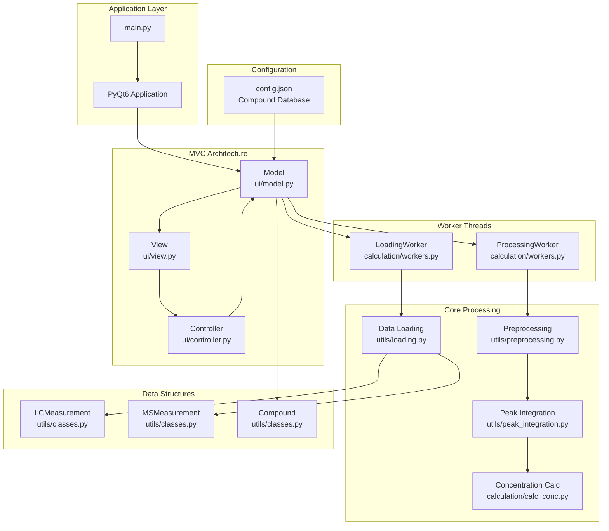
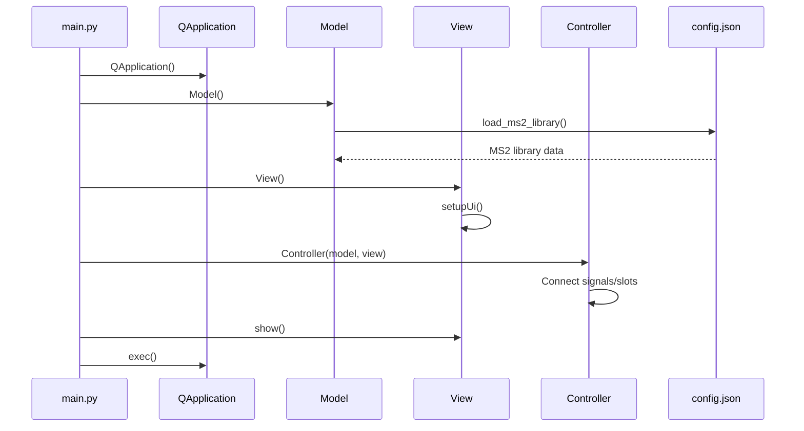
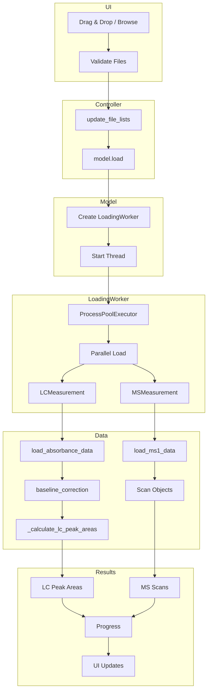
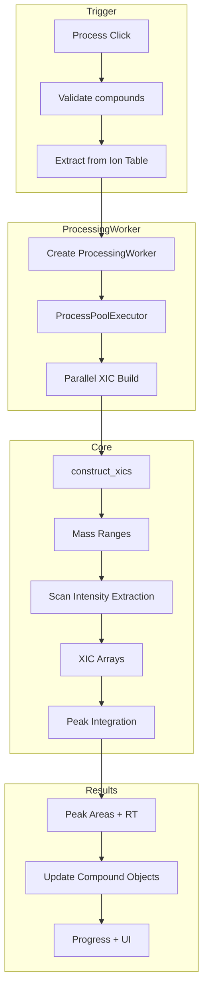
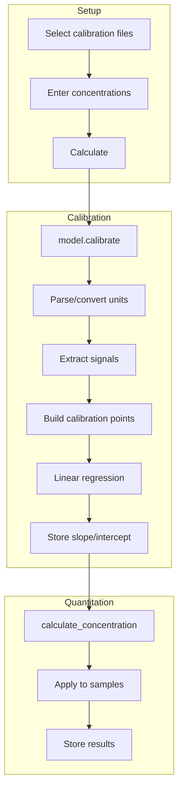
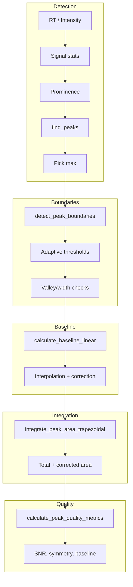
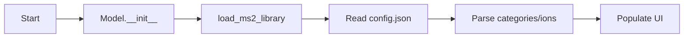
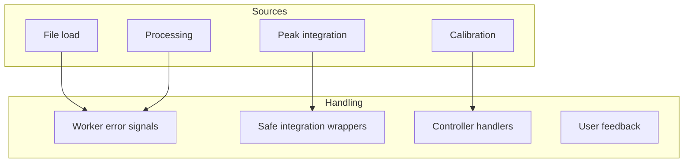
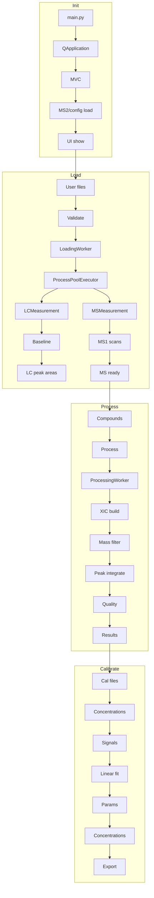
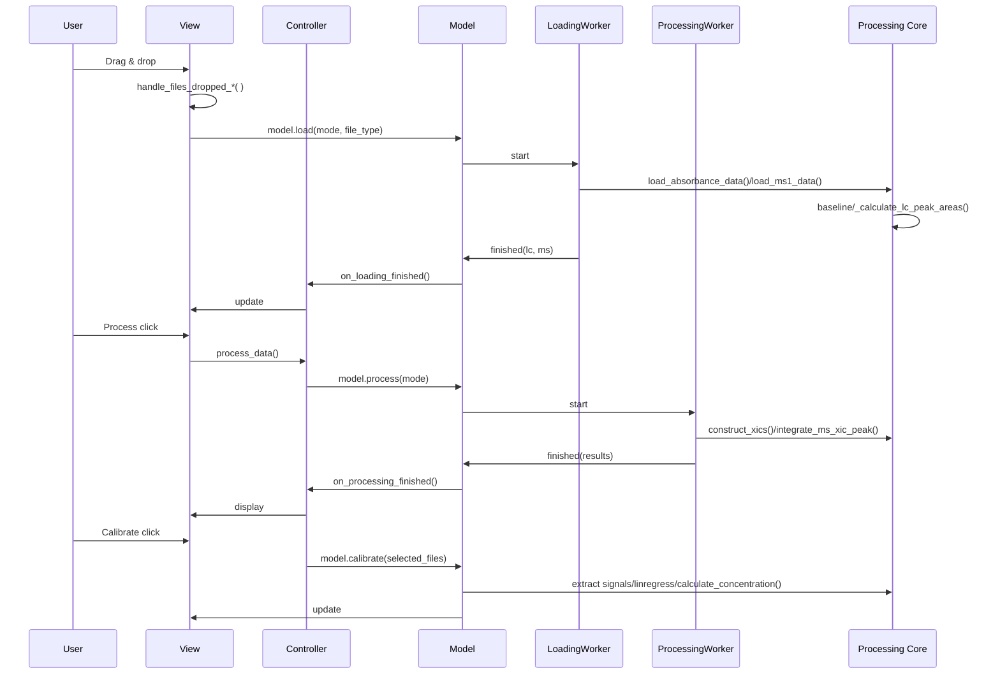

# LC-Inspector Processing Pipeline

Technical reference for LC/GC-MS data loading, processing, integration, and quantitation.

---

## Table of Contents

1. [Architecture](#architecture)
2. [MVC Components](#mvc-components)
3. [Application Initialization](#application-initialization)
4. [File Loading](#file-loading)
5. [Data Processing](#data-processing)
6. [Calibration and Quantitation](#calibration-and-quantitation)
7. [Peak Integration](#peak-integration)
8. [Configuration and Compound Database](#configuration-and-compound-database)
9. [Error Handling and Threads](#error-handling-and-threads)
10. [End-to-End Flow](#end-to-end-flow)

---

## Architecture

MVC application with worker threads for I/O and CPU-bound work.



---

## MVC Components

- Model (ui/model.py)
  - Holds ms_measurements, lc_measurements, annotations, compounds.
  - Starts and tracks LoadingWorker and ProcessingWorker.
  - Calibrates via linear regression (calibrate()).
  - Loads MS2 library and exports results.

- View (ui/view.py)
  - Tabs for Upload, Results, Quantitation.
  - Drag/drop (DragDropListWidget), PyQtGraph plots, progress indicators.
  - Ion/compound configuration UI.

- Controller (ui/controller.py)
  - Connects signals to model actions.
  - Orchestrates load/process/calibrate workflows.
  - Validates user input and propagates errors.

---

## Application Initialization



Key steps:
- configure_logging() in main.py sets file/console logging.
- Create QApplication with Fusion style.
- Instantiate Model, View, Controller.
- Load MS2 library (utils/loading.py: load_ms2_library()).
- Connect signals.

---

## File Loading



Details:
- Supported formats
  - LC: .txt, .csv
  - MS: .mzML
- Validation: handle_files_dropped_LC/MS in ui/view.py.
- Worker: LoadingWorker(model, mode, file_type); signals: progressUpdated, finished, error.
- Parallelism: ProcessPoolExecutor(max_workers=max(1, cpu_count-3)).
- LC: load_absorbance_data() → baseline_correction() → _calculate_lc_peak_areas().
- MS: load_ms1_data() (pyteomics.mzml) → scan list with RT index.

---

## Data Processing



Input validation (controller.py):
```python
def process_data(self):
    self.model.compounds = self.view.ionTable.get_items()
    if not self.model.compounds:
        self.view.show_critical_error("No compounds found!")
        return
```

XIC construction (utils/preprocessing.py: construct_xics()):
```python
def construct_xics(data, ion_list, mass_accuracy, file_name):
    compounds = copy.deepcopy(ion_list)
    for compound in compounds:
        for ion in compound.ions.keys():
            mass_range = (ion-3*mass_accuracy, ion+3*mass_accuracy)
            xic = []
            for scan in data:
                idx = np.where((scan['m/z array'] >= mass_range[0]) &
                               (scan['m/z array'] <= mass_range[1]))
                intensities = scan['intensity array'][idx]
                xic.append(np.sum(intensities))
            # store xic per ion
```

Peak integration: integrate_ms_xic_peak() (utils/peak_integration.py) returns area, boundaries, and quality metrics.

---

## Calibration and Quantitation



Signal extraction priority (ui/model.py: calibrate()):
```python
compound_signal = 0
use_peak_areas = False
for ion in compound.ions.keys():
    ion_data = ms_file.xics[i].ions[ion]
    area = ion_data.get('MS Peak Area', {}).get('baseline_corrected_area', 0)
    if area and area > 0:
        compound_signal += area
        use_peak_areas = True
    else:
        intens = ion_data.get('MS Intensity')
        if intens is not None:
            compound_signal += float(np.round(np.sum(intens[1]), 0))
```

Concentration calculation (calculation/calc_conc.py):
```python
def calculate_concentration(area, curve_params):
    slope = curve_params['slope']
    intercept = curve_params['intercept']
    if slope == 0:
        return 0
    conc = (area - intercept) / slope
    if np.isnan(conc) or not np.isfinite(conc):
        return 0
    return round(conc, 6)
```

---

## Peak Integration



Adaptive prominence example:
```python
signal_max = np.max(corrected_values)
signal_std = np.std(corrected_values)
noise_level = np.std(corrected_values[corrected_values <= np.percentile(corrected_values, 25)])
baseline_level = np.percentile(corrected_values, 10)

prominence_threshold = max(
    5.0,
    noise_level * 4,
    signal_std * 2,
    (signal_max - baseline_level) * 0.005
)
```

Quality metrics:
- SNR estimation from lower percentile noise.
- Symmetry (USP tailing).
- Baseline stability in flanking regions.
- Combined score from the above.

---

## Configuration and Compound Database

config.json structure:
```json
{
  "Amino acids and polyamines (DEEMM)": {
    "Adenine": {
      "ions": [306.1197, 260.0779, 476.1776],
      "info": ["Adenine-D", "Adenine-NL", "Adenine-D-D"]
    }
  },
  "Short-chain fatty acids": {},
  "Flavonoids": {},
  "Terpenoids": {}
}
```

Loading flow:


---

## Error Handling and Threads



Worker example (calculation/workers.py):
```python
class LoadingWorker(QThread):
    progressUpdated = pyqtSignal(int, str)
    finished = pyqtSignal(dict, dict)
    error = pyqtSignal(str)

    def run(self):
        try:
            # load and preprocess
            self.finished.emit(lc_results, ms_results)
        except Exception as e:
            logger.error("Error in loading pool", exc_info=True)
            self.error.emit(str(e))
```

Safe integration wrapper:
```python
def safe_peak_integration(integration_func, *args, **kwargs):
    try:
        return integration_func(*args, **kwargs)
    except InsufficientDataError:
        logger.warning("Insufficient data; using fallback")
        return create_fallback_peak_area(*args)
    except Exception:
        logger.error("Peak integration failed", exc_info=True)
        return create_fallback_peak_area(*args)
```

---

## End-to-End Flow




